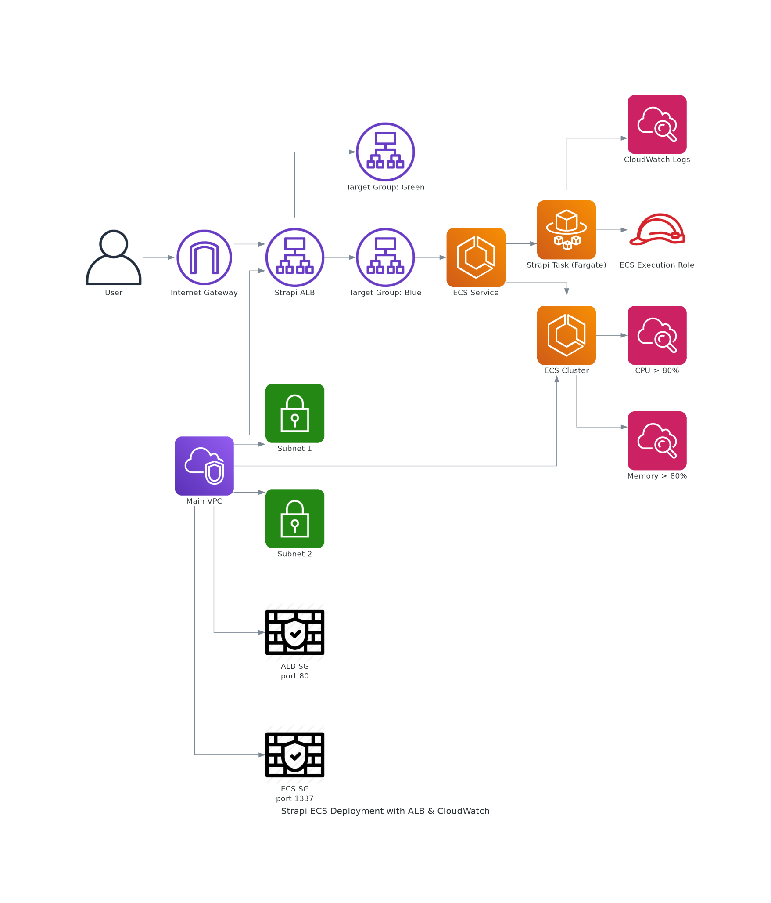

# Terraform2 Directory

This directory contains Terraform configurations for deploying a Strapi application on AWS ECS using blue/green deployments with CodeDeploy.

## Infrastructure Overview

The Terraform configuration in this directory deploys the following infrastructure:

*   **VPC:** A Virtual Private Cloud (VPC) with public subnets.
*   **Security Groups:** Security groups for the ALB and ECS tasks.
*   **ECS Cluster:** An ECS cluster to run the Strapi application.
*   **ECS Task Definition:** Defines the Strapi container, including image, port mappings, and logging.
*   **ECS Service:** Manages the Strapi application deployment and integrates with CodeDeploy for blue/green deployments.
*   **Application Load Balancer (ALB):** Distributes traffic to the Strapi application.
*   **Target Groups:** Blue and green target groups for the ALB to facilitate blue/green deployments.
*   **CodeDeploy Application and Deployment Group:** Configures CodeDeploy for ECS deployments, enabling automated blue/green deployments.
*   **CloudWatch Logs:** Configures CloudWatch Logs for container logging.
*   **IAM Roles:** IAM roles for ECS task execution and CodeDeploy.


## File Breakdown

*   `vpc.tf`: Defines the VPC and subnet resources.
*   `security-group.tf`: Defines the security groups for the ALB and ECS tasks.
*   `ecs.tf`: Defines the ECS cluster, task definition, and service.
*   `load-balancer.tf`: Defines the ALB, target groups, and listener.
*   `iam.tf`: Defines the IAM roles and policies.
*   `codedeploy.tf`: Defines the CodeDeploy application and deployment group.
*   `cloudwatch.tf`: Defines CloudWatch metric alarms and log groups.
*   `variables.tf`: Defines the input variables.
*   `output.tf`: Defines the output values.
*   `terraform.tfvars`: Stores the values for the variables.
*   `README.md`: This file, providing an overview of the directory.

## Prerequisites

Before using this Terraform configuration, you need to have the following:

*   An AWS account.
*   The Terraform CLI installed.
*   The AWS CLI installed and configured with your AWS credentials.
*   A Docker image of your Strapi application pushed to a container registry (e.g., Docker Hub, ECR).
*   An S3 bucket to store the Terraform state file (configured in the `backend` block in `main.tf` - not currently enabled).

## Configuration

The following variables can be configured in the `terraform.tfvars` file:

*   `image_uri`: The URI of the Docker image for the Strapi application (e.g., `your-ecr-repo/strapi-app:latest`).
*   `region`: The AWS region to deploy to (e.g., `us-east-1`).

## Usage

1.  Initialize Terraform:

    ```bash
    terraform init
    ```

2.  Create a Terraform plan:

    ```bash
    terraform plan
    ```

3.  Apply the Terraform configuration:

    ```bash
    terraform apply
    ```

## CodeDeploy Configuration

This configuration uses CodeDeploy for blue/green deployments. The `codedeploy.tf` file defines the CodeDeploy application and deployment group. The `load-balancer.tf` file defines the target groups for the blue and green environments.

## IAM Roles

The `iam.tf` file defines the IAM roles required for the ECS tasks and CodeDeploy deployments. Make sure that these roles have the necessary permissions to access the AWS resources.
