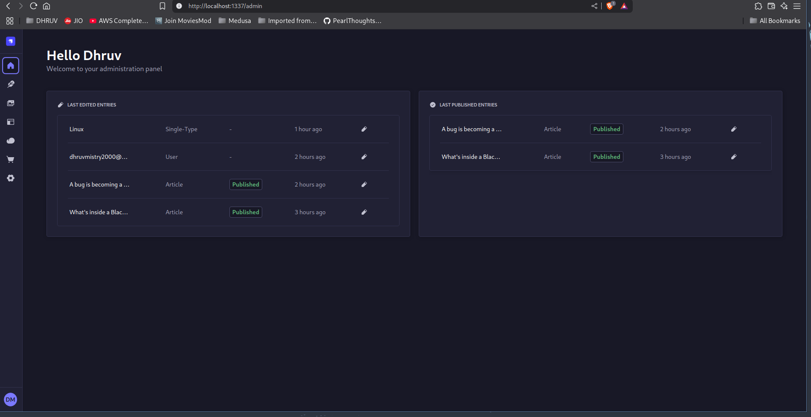
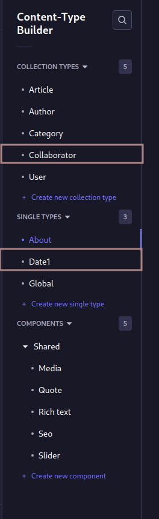

# Day 1

Today I attended the session of the Training where I got to know what ar our goals and also the team solved all our doubt.
We were assigned with the task to deploy STRAPI locally and make a new Content type on the local machine.I opend the strapi website and started reading the documentation of that it is and how to deploy it. It was a simple command:-
 ```bash 
npx create-strapi-app@latest
```
then just use the following command to build the project and then see the web dashboard.
```bash
npm build 
```
```bash
npm run develop
```

After then I started exploring the dashboard and also i was going through the dir structure.



After that i made a new content type in "Collection type" named "Collabarator" and "Single type" named "Date1" and then at last initilised the repo and pushed it to Github.



# Command Used

1) To Install strapi, build and deb server are the following command.
```bash
npx create-strapi-app@latest
```
```bash
npm build
```
```bash
npm run develop
```

2) Initilise the git repository and adding remote to it and making branch 

```bash
git init
```
```bash
git add .
```
```bash
git commit -m "Message"
```
```bash
git remote add origin https://github.com/PearlThoughts-DevOps-Internship/Strapi-Code-deployers
```
```bash
git branch -m dhruvmistry
```
```bash
git push origin dhruvmistry
```


