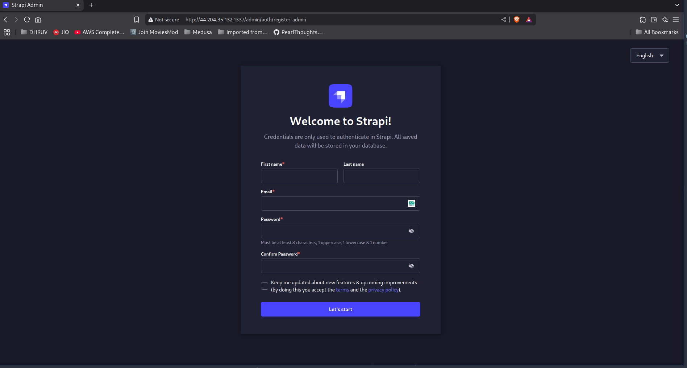

# Day 3
Today's task was to create a Dockerfile and push it to DockerHub or AWS ECR (I chose DockerHub). Then, I started an EC2 instance using Terraform, SSHed into it, installed Docker, and ran the Docker image. It was easy for me as I am very familiar with Docker since I use it in my day-to-day tasks. Below are the steps I used to perform today's task.I made a mistake on the first trial as i manually started the instance and installed and run docke but now i have automated it. It takes 5 10 min as we are bottleneck by the cpu of t2.mirco



# Commands Used
1) Build the [Docker image](../../Dockerfile):
```bash
docker build -t strapi .
```

2) Tag the Docker image:
```bash
docker tag strapi dhruvmistry200/strapi
```

3) Push the image to DockerHub. [DockerHub Image](https://hub.docker.com/r/dhruvmistry200/strapi):
```bash
docker push dhruvmistry200/strapi
```

4) Initialize, plan, and apply Terraform. [Terraform config](../../Terraform2/main.tf):
```bash
terraform init
```
```bash
terraform plan
```
```bash
terraform apply --auto-approve
```
5) Destroy all Terraform resources:
```bash
terraform destroy --auto-approve
```